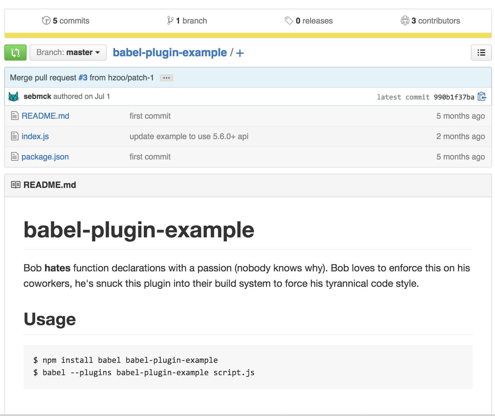
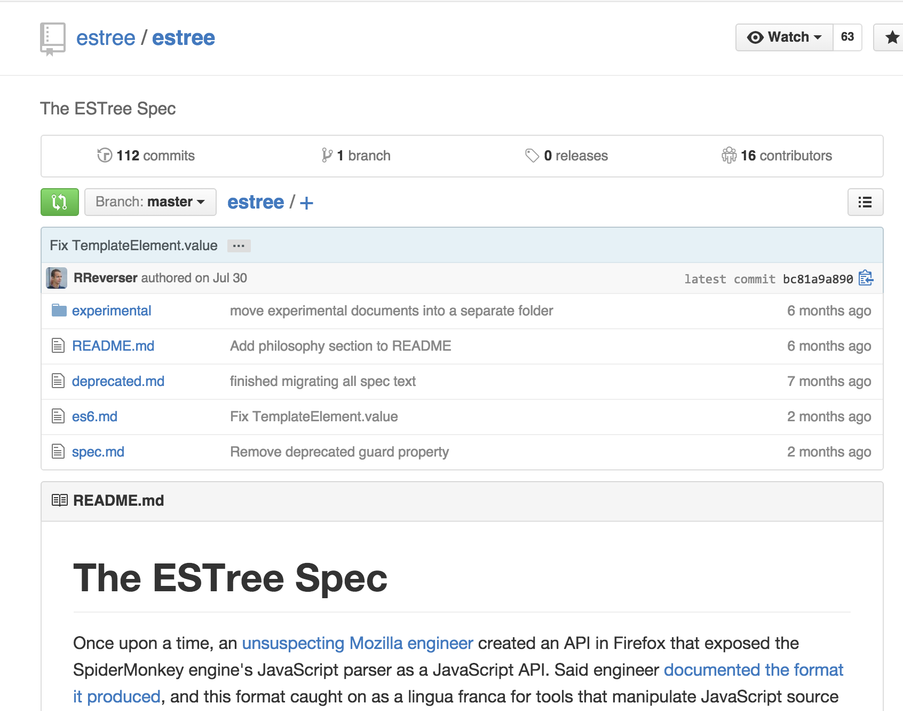
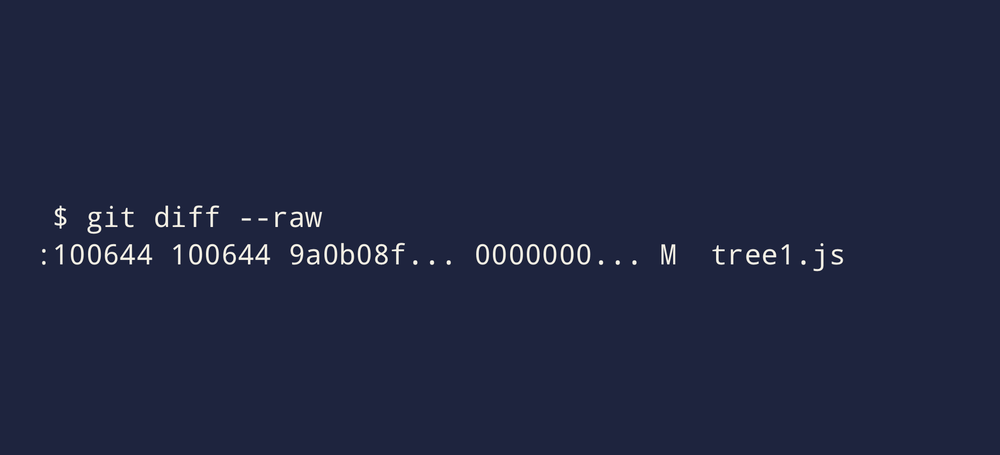
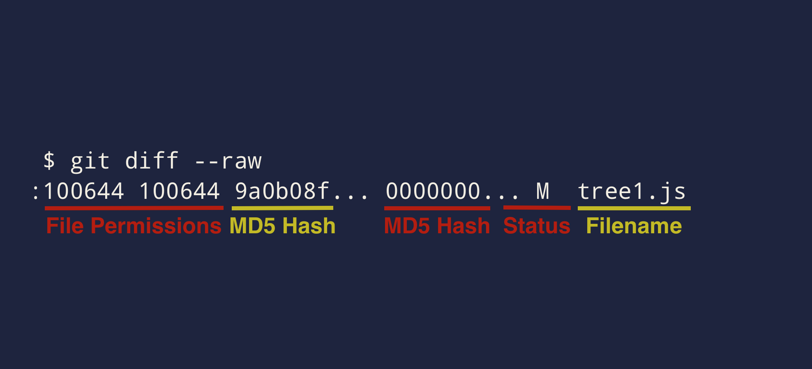
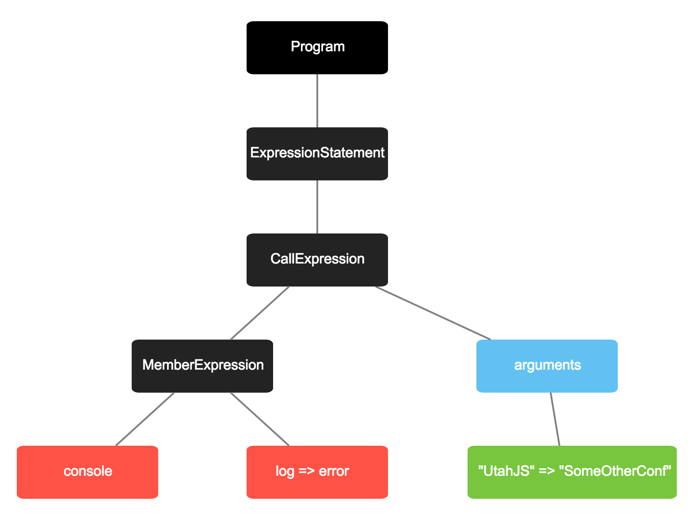
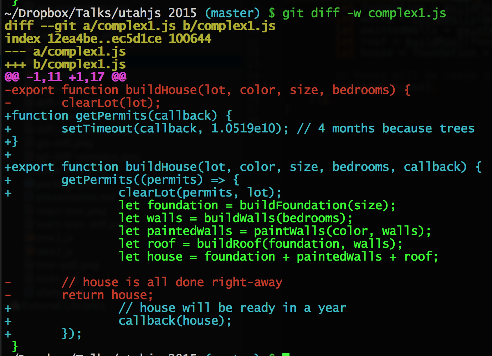

## Harnessing the power of __*Abstract Syntax Trees*__

---

# *__Parsers__* 

^ Who knows about parsers?

---

```js
console.log("UtahJS");
```
^ They take code and turn it into a tree.

---


---
```js
{
	type: "Program",
	body: [
		{
			type: "ExpressionStatement",
			expression: {
				type: "CallExpression",
				callee: {
					type: "MemberExpression",
					computed: false,
					object: {
						type: "Identifier",
						name: "console"
					},
					property: {
						type: "Identifier",
						name: "log"
					}
				},
				arguments: [
					{
						type: "Literal",
						value: "UtahJS",
						raw: "\"UtahJS\""
					}
				]
			}
		}
	]
}
```

^ In JavaScript an AST is basically a JSON representation of your code.I know what you're thinking. You like the other version better?
I do to. Let's stick with pictures...

---


^ Isn't that better

---


# *__Acorn__*

^ is the parser to beat these days

^ it's used by babel, so you know it's good.

---

# *__Espree__*

^ Is the parser I know the best. It's a fork off esprima, with better ES6 stuff and it's what we use in ESLint.
Which I work on a bit.

---

# Parsing

```js
// generate an AST from a string of code
espree.parse("console.log('UtahJS')");
```

^ Parsers are treat and in general super simple. I just pass in some code.

---

# Parsing

```js
// generate an AST from a string of code
acorn.parse("console.log('UtahJS')");
```

^ Now you could swap that out with acorn if you wanted without much work....it's the same API and produces very similar output.

---

# Parsing ES6

```js
// generate an AST from a string of code
acorn.parse("console.log('UtahJS')", { ecmaVersion: 6 });
```

^ you want to turn on es6 stuff, Here's how you'd do that. Options are different between parsers, but the API is the same, and the tree is basically the same. 

---


# *ASTs are Everywhere*

^ They're in browsers, in transpilers, minifiers. All of the cool build tools these days 
are relying on ASTs to safely turn your code into play doe. Now why should you care? Wel...

---


How many of you use *__babel__*?

^ To the first point. How many of use use babel?
I would definitley recommend looking at Babel Plugins as a great place to start if you're
interested in writing these "codemod" tools that change your JS from one thing to another.

---




^ Let's take a look at the example repo. It's 1 actual file. 

---

# Babel Plugin

```js
module.exports = function (Babel) {
    return new Babel.Plugin("plugin-example", {
        // visitor: {
        //     "FunctionDeclaration": swapWithExpression
        // }
    });
};
```

---

# Babel Plugin

```js
module.exports = function (Babel) {
    return new Babel.Plugin("plugin-example", {
        visitor: {
            "FunctionDeclaration": swapWithExpression
        }
    });
};
```

^ 15 lines of code. this is fractal level of how a tiny bit of code can lead to huge changes. And what do you have to know? Not very much!
What they rely on here is basic knowledge of the AST format. They're talkin about `FunctionDeclaration`s and basically replacing them with
`FunctionExpression` wrapped in a `VariableDeclaration`. It's not rocket science, but it can take your code to the moon.

---

# Guts


```js
function swapWithExpression(node, parent) {
    var id = node.id;    
    // change the node type
    // node.type = "FunctionExpression";
    // node.id  = null;
    // return a variable declaration
    // return Babel.types.variableDeclaration("var", [
    //    Babel.types.variableDeclarator(id, node)
    // ]);
}
```

---

# Guts


```js
function swapWithExpression(node, parent) {
    var id = node.id;
    // change the node type
    node.type = "FunctionExpression";
    node.id  = null;
    // return a variable declaration        
    // return Babel.types.variableDeclaration("var", [
    //    Babel.types.variableDeclarator(id, node)
    // ]);
}
```

---

# Guts


```js
function swapWithExpression(node, parent) {
    var id = node.id;
    // change the node type
    node.type = "FunctionExpression";
    node.id  = null;
    // return a variable declaration        
    return Babel.types.variableDeclaration("var", [
        Babel.types.variableDeclarator(id, node)
    ]);
}
```

---

# Know Your *__NODES__*

^ In order to do this stuff though you have to learn 
all of the different nodes. This the stuff that makes
up the trees.  Now there are * ALOT * of nodes.

---

# ES6 Specifics

---

# Statements

```md
  - ForOfStatement
```

---

# Expressions

```md
  - ArrowFunctionExpression
  - YieldExpression
```

---
# Template Literals

```md
  - TemplateLiteral
  - TaggedTemplateExpression
  - TemplateElement
```
  
---
## Patterns
```md
  - ObjectPattern
  - ArrayPattern
  - RestElement
  - AssignmentPattern
```

^ these are like destructuring or whatever

---

## Classes

```md
  - ClassBody
  - MethodDefinition
  - ClassDeclaration
  - ClassExpression
  - MetaProperty
```

---

## Modules

```md
  - ModuleDeclaration
  - ModuleSpecifier
  - ImportDeclaration
  - ImportSpecifier
  - ImportDefaultSpecifier
  - ImportNamespaceSpecifier
  - ExportNamedDeclaration
  - ExportSpecifier
  - ExportDefaultDeclaration
  - ExportAllDeclaration
```

^ bleh. too much to learn. don't forgoet all of the rest of it.... 

---



^ IF you want to learn this stuff you need to go here. It's the repo for something called
called `ESTree`. Basically all of the major parser folks got together including babel people
and whatever and decided to speak the same language for building their trees. Now this built on top
of an older spec called the Spidermonkey API, but it supersedes and replaces it.

---


# An *__AST__* gives you super powers

^ I mentioned already that an AST is basically a JSON representation of your code.
^ But I didn't mention that they can give you actual super powers. 
^ Once you understand how ASTs work you can use them to build things that have never been built before.
^ That change how we interact with our programs. 
^ In case you think I'm messing with you, let's build something amazing! Right here. Right now.
^ it will be hard. but we can do hard things.

---


^ I love this quote from the book Learning Perl. I also like LLamas.

---

> "Making easy things easy & hard things possible"
- Learning Perl

^ Not sure if you could see it on the cover was "Making easy things easy & hard things possible". In JavaScript ASTs make hard things possible. I want to show you an example.

---

# JS Aware <br> *__git diff__*

^ This is a hard thing, but we're going to build it using syntax trees.

---

```js
console.log("UtahJS");
```

^ Let's start with some code

---

```js
console.log("SomeOtherConf");
```

^ But let's say I want to speak at another conference

---

```js
console.error("SomeOtherConf");
```

^ You know what. That's not cool. Let's make and error. So we started with logging UtahJs and end up with an error log about another conf What. 

---


^ let's diff this using normal `git giff` and see what happeend. ok , great. everything changed. thanks. how helpful of you. Can we do better?

---

# __*Yes we can!*__

^ And do you know why. Because Syntax Trees are great is why.

---

# *__Version 1__*

```md
1. Create ASTs from the old and new files
2. Run a tree-diffing algorithm
3. Display the differences in a useful way
```

^ Let's break down how we'll achieve this spectacle.

---

```
git diff
```

^ first thing we need to do is this is get our output into something readable for js. This displays the changes, but we actually need the entire contents of the original file. In order to do that we need more information. 

---



^ first thing we need to do is this is get our output into something readable for our javaScript progtram

---



^ What we care about here is the md5 hash of the original version of the file and the filename. We can use `git show` on the md5 hash to get
the original version of the file and we can use of course use the filename to get the current version. Now that we've learned how to read this output, let's teach our computer.

---

```js
git diff --raw | node compare.js
```

^  We'll start by piping it all into our node program .... Which we'll build out now ...

----

```js
// let's read all of this input from stdin into an array
var lines = fs.readFileSync('/dev/stdin').toString().split('\n');
```

^ let's read all of the input off of stdin

---

```js
// lines now looks something like this
[':100644 100644 9a0b08f... 0000000... M	tree1.js']
```
^ yep. following me? because we're going to move quickly.

---

```js
lines.map(function(line) {
	var parts = line.split(' ');
	// var file = parts.pop().split('\t');
	// return [file[1], parts[2].slice(0, -3)];
});
```
^ next we'll map each of these lines into a tuple of the two important parts of that line

---

```js
lines.map(function(line) {
	var parts = line.split(' ');
	var file = parts.pop().split('\t');
	// return [file[1], parts[2].slice(0, -3)];
});
```
^ next we'll map each of these lines into a tuple of the two important parts of that line

---

```js
lines.map(function(line) {
	var parts = line.split(' ');
	var file = parts.pop().split('\t');
	return [file[1], parts[2].slice(0, -3)];
});
```
^ next we'll map each of these lines into a tuple of the two important parts of that line

---

```js
// the key parts of our git diff
[ [ "tree1.js", "9a0b08f"] ]
```

---

# Parsing

```js
// generate an AST from a string of code
espree.parse("console.log('UtahJS)");
```

^ once I get the actual JavaScript all i need to do is run `espree.parse()`. So let's convert our
tuple of files into some trees, sound goood?

---

```js
.map(function(files) {
	var after = fs.readFileSync(files[0]);
	// var before = child_process.execSync("git show" + files[1]);
	// return {
	//	  filename: files[0],
	//	  before: espree.parse(before, options),
	//	  after: espree.parse(after, options)
	// };
})
```
^ And now: Trees

---

```js
.map(function(files) {
	var after = fs.readFileSync(files[0]);
	var before = child_process.execSync("git show" + files[1]);
	// return {
	//	  filename: files[0],
	//	  before: espree.parse(before, options),
	//	  after: espree.parse(after, options)
	// };
})
```
^ And now: Trees

---

```js
.map(function(files) {
	var after = fs.readFileSync(files[0]);
	var before = child_process.execSync("git show" + files[1]);
	return {
		filename: files[0],
		before: espree.parse(before, options),
		after: espree.parse(after, options)
	};
})
```
^ And now: Trees

---

```js
.map(function(files) {
	var after = fs.readFileSync(files[0]);
	var before = child_process.execSync("git show" + files[1]);
	return {
		filename: files[0],
		before: espree.parse(before, options),
		after: espree.parse(after, options)
	};
})
```
^ And now: Trees

---

```js
[{
		filename: "trees1.js",
		before: { type: "Program", body: [Object] },
	    after: { type: "Program", body: [Object] } 
}]
```

^ With that we now have gone from an array of stdin to an array of objects
with the filename and before an after trees... in not all the much code

---

# [fit] *FITS ON ONE SLIDE**

---

```js
var lines = fs.readFileSync('/dev/stdin').toString().split('\n');
var trees = lines.map(function(line) {
	var parts = line.split(' ');
	var file = parts.pop().split('\t');
	return [path.resolve(file[1]), parts[2].slice(0, -3)];
}).filter(function(files) {
	return files[0].indexOf('.js') > -1;
}).map(function(files) {
	var after = fs.readFileSync(files[0]);
	var before = child_process.execSync("git show " + files[1]);
	return {
		filename: files[0],
		before: espree.parse(before, options),
		after: espree.parse(after, options)
	};
});
```

^ Here's what it looks like altogeher....and now....pictures.... 
Here's what those trees look like...

---


^ Here's the first one. Where we're console.loggin("utahJS");

---


^ And of course the final change where we decide that was in error.....we've got the trees.

---

## __*Step 2*__


```js

// let's see if something changed
var different = deepEqual(treeBefore, treeAfter);
```

^ Now to comapre the two for differences, because they're _just objects_ we can use
a standard `deepEqual` function from a library like lo
dash or whatever. Here's a quick one I 
threw together that works well enough for this example


---

```js
function deepEqual(a, b) {
	if (a === b) {
		return true;
	}
	if (!a || !b) {
		return false;
	}
	if (Array.isArray(a)) {
		return a.every(function(item, i) {
			return deepEqual(item, b[i]);
		});
	}
	if (typeof a === 'object') {
		return Object.keys(a).every(function(key) {
			return deepEqual(a[key], b[key]);
		});
	}
	return false;
}
```

^ Super standad stuff. Not particularly fancy. You run that on these trees and it will tell you that there's a difference, but
we're interested in where the differences lie. To do that we have to add a few things. We know that each node in the tree is likely
to be an object, so we go to that conditional and we start messing around.

---

```js
function deepEqual(a, b) {
	// if (a === b) {
	//	return true;
	// }
	// if (!a || !b) {
	//	return false;
	// }
	// if (Array.isArray(a)) {
	//	return a.every(function(item, i) {
	//		return deepEqual(item, b[i]);
	//	});
	// }
	if (typeof a === 'object') {
		return Object.keys(a).every(function(key) {
			return deepEqual(a[key], b[key]);
		});
	}
	return false;
}
```

^ Super standad stuff. Not particularly fancy. You run that on these trees and it will tell you that there's a difference, but
we're interested in where the differences lie. To do that we have to add a few things. We know that each node in the tree is likely
to be an object, so we go to that conditional and we start messing around.

---

```js
if (typeof a === 'object') {
    return Object.keys(a).every(function(key) {
        return deepEqual(a[key], b[key]);
    });
}
return false;
```

---

```js
if (typeof a === 'object') {
	var equal = Object.keys(a).every(function(key) {
		return deepEqual(a[key], b[key]);
	});
	return equal;
}
return false;
```

---

```js
if (typeof a === 'object') {
	// var equal = Object.keys(a).every(function(key) {
	//	return deepEqual(a[key], b[key]);
	// });
	if (!equal) {	
		console.log('[' + a.type + '] => [' + b.type + ']');
	}
	// return equal;
}

console.log('"' + a + '" => "' + b + '"');
// return false;
```

^ we'll modify this to log the node types when they aren't the same. we'll also log
the values when any comparison between literals is not the same.

---

```
git diff --raw | node compare.js 
```

```js
"log" => "error"
[Identifier] => [Identifier]
[MemberExpressio] => [MemberExpression]
[CallExpression] => [CallExpression]
[ExpressionStatement] => [ExpressionStatement]
[Program] => [Program]
```

^ With this super small modification of our deep equal we're now able to see a little bit
more about what changed. 

---


^ Whereas before you see the whole code. Now you get to see the whole tree.

---



^ Now you can see the full tree with changes marked clearly. It's powerful. For our last trick we're going to endeavor to make this actually useful on a large scale. 

---


^ Of course where this cool tree diff falls apart is when you have more than 1 or 2 small changes. Here's a progran with around 30 lines.

---


## *I Can't process this tree*
## in my head

---

# Toward A Better Diff


```md
- require() statement changes?
- Changes to variables?
- Function argument changes
- Breaking Changes?
```

^ What would a better diff do. We have the trees, let's do somethign with them.
To keep this simple, but still useful I want to look at how you might go about detecting breaking changes.
Which we'll simply define as changes to inputs and outputs. How might we detect them?

---

```js
export function buildHouse(lot, color, size, bedrooms) {
	clearLot(lot);
	let foundation = buildFoundation(size);
	let walls = buildWalls(bedrooms);
	let paintedWalls = paintWalls(color, walls);
	let roof = buildRoof(foundation, walls);
	let house = foundation + paintedWalls + roof;

	// house is all done right-away
	return house;
}
```

^ Recently my family and I moved to lovely vashon Island, Washington. It's so nice and awesome and there are trees everywhere and whales and 
the power goes out all the time. And it's just amazing. And we bought this lot where we wnated to build a house and we picked out the color we
wanted and the size and how many bedrooms and we got our builder and told him we were all ready to go. This function represents how we thought
the process should go.
- clear the lot
- build the foundation
- the walls
- paint some stuff
- build a room
- and just like you're done. put it all together. move in. send me some dishes.
here's reality

---

```js
function getPermits(callback) {
	setTimeout(callback, 1.0519e10); // 4 months because trees
}

export function buildHouse(lot, color, size, bedrooms, callback) {
	getPermits((permits) => {
		clearLot(permits, lot);
		let foundation = buildFoundation(size);
		let walls = buildWalls(bedrooms);
		let paintedWalls = paintWalls(color, walls);
		let roof = buildRoof(foundation, walls);
		let house = foundation + paintedWalls + roof;

		// house will be ready in about a year
		callback(house);
	});
}

```

^ it turns out you need to get permits, before you can even clear the lot. It doesn;t
even matter that i bought the thing. They don't care. you can't touch it until the permits
come back, so what dooes that mean? We need a callback.
There are no promises when dealing with "King County". Trust me. (bad joke?)

---



^ even if we disable the whitespace the diff is almost useless. new stuff is mixed in with the old stuff. the return statement turning into a 
callback isn't that bad. the nesting of everything is gone. Because we added the getPermits function it doesnt' realize that only actual
change to our exported buildHouse functino was just the addition of the callback. It think's it's a new function. Which isn't so helpful. Let's
build smarter.

---

# Our Goal

```
git diff --raw | node compare.js

house.js
1. The exported `buildHouse` function output went from a return to a callback.
2. The private `getPermits` function was added.

```

^ What I want is for this to tell me what's going on in the world. The big picture. Let's see if we can get there in the next 3 minutes.
First let's recap what our data structure looks like:

---

# Our Data Structure


```js
[{
		filename: "trees1.js",
		before: { type: "Program", body: [Object] },
	    after: { type: "Program", body: [Object] } 
}]
```
^ So we have an array of objects representing the before and after ASTs for any changed file. Simple, yeah? In order to do something useful we'll need something more
powerful than our little `deepEqual` algorithm from before. We're goin gto use a tool called ESrecurse.

---

# Introducing ESRecurse

```js
var esrecurse = require('esrecurse');

esrecurse.visit(ast, {
	FunctionDeclaration: function(node) {
		console.log(node);
	}
});
```


^ ESrecurse has an interesting API. Where you basically pass in an object. With the names of the nodes in the tree that we care about. It will then pass you only those nodes. Handy for inspecting a subset of your tree. If you've ever written an ESLint rule or a babel plugin you'll probably be familiar with the API. For linters we use this to inspect nodes for violations to rule violations. You might inspect a `VariableDeclaration` to ensure you were using `let` instead of `var` or whatever. In our case we're going to look for nodes of type `ExportNamedDeclaration` and `FunctionDeclaration`.

---

# Visiting Our Trees

```js
esrecurse.visit(diff.before, {

	// export function a() {}
	ExportNamedDeclaration: function(node) { 
		var details = inspectFunction(node.declaration, "exported");
		functions[details.name].before = details;
	},
	
	// function a() {}
	// FunctionDeclaration: function(node) {
	//	  var details = inspectFunction(node.declaration);
	//	  functions[details.name].before = details;
	// }
});
```

---

# Visiting Our Trees

```js
esrecurse.visit(diff.before, {

	// export function a() {}
	ExportNamedDeclaration: function(node) { 
		var details = inspectFunction(node.declaration, "exported");
		functions[details.name].before = details;
	},
	
	// function a() {}
	FunctionDeclaration: function(node) {
		var details = inspectFunction(node.declaration);
		functions[details.name].before = details;
	}
});
```

---

# Inspecting Function Declarations

```js

function inspectFunction(node, visiblity) {
	return {
		name: node.id.name, // "buildHouse",
		// params: node.params.map(function(param) {
		//	return param.name;
		// }), // ["lot", "color", "size", ...]
		// visibility: visiblity || "private",
		// outputType: getOutputType(node)
	};
}
```

^ Let's see what that function looks like....We care about a few things. 
1. Let's get the name of the function.
2. All of it's paramaters
3. We have something called visiblity which will tell us if it's being exported or not.
3. Lastly we get the output type.. >This is hard., but basically we just look to see if there's a callback as the last paramater...

---

# Inspecting Function Declarations

```js

function inspectFunction(node, visiblity) {
	return {
		name: node.id.name, // "buildHouse"
		params: node.params.map(function(param) {
			return param.name;
		}), // ["lot", "color", "size", ...]
		// visibility: visiblity || "private",
		// outputType: getOutputType(node)
	};
}
```

^ Let's see what that function looks like....We care about a few things. 
1. Let's get the name of the function.
2. All of it's paramaters
3. We have something called visiblity which will tell us if it's being exported or not.
3. Lastly we get the output type.. >This is hard., but basically we just look to see if there's a callback as the last paramater...

---

# Inspecting Function Declarations

```js

function inspectFunction(node, visiblity) {
	return {
		name: node.id.name, // "buildHouse"
		params: node.params.map(function(param) {
			return param.name;
		}), // ["lot", "color", "size", ...]
		visibility: visiblity || "private",
		// outputType: getOutputType(node)
	};
}
```

^ Let's see what that function looks like....We care about a few things. 
1. Let's get the name of the function.
2. All of it's paramaters
3. We have something called visiblity which will tell us if it's being exported or not.
3. Lastly we get the output type.. >This is hard., but basically we just look to see if there's a callback as the last paramater...

---

# Inspecting Function Declarations

```js

function inspectFunction(node, visiblity) {
	return {
		name: node.id.name, // "buildHouse"
		params: node.params.map(function(param) {
			return param.name;
		}), // ["lot", "color", "size", ...]
		visibility: visiblity || "private",
		outputType: getOutputType(node)
	};
}
```

^ Let's see what that function looks like....We care about a few things. 
1. Let's get the name of the function.
2. All of it's paramaters
3. We have something called visiblity which will tell us if it's being exported or not.
3. Lastly we get the output type.. >This is hard., but basically we just look to see if there's a callback as the last paramater...

---

```
git diff --raw | node compare.js
```

```js
[ filename: "house.js",
  functions: {
  	buildHouse: {
  	  before:  { name: "buildHouse", /* ... */ },
      after:  { name: "buildHouse", /* ... */ }
    }
    getPermits: {,
      after: { name: "getPermits", /* ... */ }
    }
 }
```

^ Now with all of that in place our command gives us an array of arrays of objects that contain the exported function
names, their paramaters and the output type. Let's put it all together....

---
```js
{
	name: "getPermits",
	visibility: "private",
	params: [ "callback" ],
	outputType: "callback"
}
```

^ Each item has the following properties...

---

# _**Data => Words**_

^ final step. ok well 3 steps. fast.

---

# Unrolling Our Array

```js
.map(function(diff) {
	return diff.filename + "\n" + getReadableOutput(diff.functions);
}).join("\n");
```

^ 1. convert each one of our array items into a string
  2. join(" ") all the array into a newline separated string. that's the end. we'll work in reverse. next step.
  
---

# Meaningful Data

```js
function getReadableOutput(functions) {
	return Object.keys(functions).reduce(function(prev, curr, i) {
		// var name = curr;
		// var visibility = functions[name].after.visibility;
		// var whatHappened = getWhatHappened(functions[name]);
		// return prev + `${i + 1}. The ${visibility} ${name} function ${whatHappened}.\n`;
	}, "");
}
```

^ So for this thing we 	use reduce() on the array of function names to generate a string
We start by seeding the "previous" with an empty string and just keep adding to it with
information about the current function. It's pretty neat. For our final step we reveal
the magic in the `getWhatHappened` function. This is what actually converts our
data human readable form.

---

# Meaningful Data

```js
function getReadableOutput(functions) {
	return Object.keys(functions).reduce(function(prev, curr, i) {
		var name = curr;
		var visibility = functions[name].after.visibility;
		var whatHappened = getWhatHappened(functions[name]);
		// return prev + `${i + 1}. The ${visibility} ${name} function ${whatHappened}.\n`;
	}, "");
}
```

^ So for this thing we 	use reduce() on the array of function names to generate a string
We start by seeding the "previous" with an empty string and just keep adding to it with
information about the current function. It's pretty neat. For our final step we reveal
the magic in the `getWhatHappened` function. This is what actually converts our
data human readable form.

---
# Meaningful Data

```js
function getReadableOutput(functions) {
	return Object.keys(functions).reduce(function(prev, curr, i) {
		var name = curr;
		var visibility = functions[name].after.visibility;
		var whatHappened = getWhatHappened(functions[name]);
		return prev + `${i + 1}. The ${visibility} ${name} function ${whatHappened}.\n`;
	}, "");
}
```

^ So for this thing we 	use reduce() on the array of function names to generate a string
We start by seeding the "previous" with an empty string and just keep adding to it with
information about the current function. It's pretty neat. For our final step we reveal
the magic in the `getWhatHappened` function. This is what actually converts our
data human readable form.

---

# human readable ftw!

```js
function getWhatHappened(func) {

	if (!func.before) {
		return "was added"
	}
	if (!func.after) {
		return "was removed"
	}
	if (func.before.outputType !== func.after.outputType) {
		return "output went from a " + func.before.outputType + " to a " + func.after.outputType;
	}
}
```

^ if it didn't exist before.  Then we can say the function "was added". If the output type changed  (like from callback to return let's note that.

---

# A Happy Ending

```
git diff --raw | node compare.js

house.js
1. The exported `buildHouse` function output went from a return to a callback.
2. The private `getPermits` function was added.
```

^ And there it is folks.

---

# TREES ARE SUPER POWERFUL


^ Remember ASTs are super powerful.
I hope I've made you want to learn more.
- Thanks

---


# [fit] *Questions?*

---
